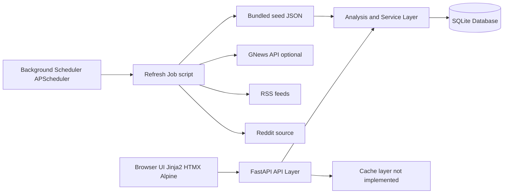

# ONE-I

ONE-I is a backend-focused news analysis system that consolidates multi-source reporting for a story and exposes structured evidence of agreement, disagreement, and framing differences through a FastAPI application.

## Overview

The system ingests article and reaction data, normalizes it into relational models, and computes analysis outputs used by server-rendered views and HTMX endpoints.

Current implementation includes:

- News ingestion from bundled JSON, RSS feeds, and optional GNews API
- Narrative analysis from sentence-level TF-IDF clustering
- Public reaction aggregation from Reddit-style comment data
- Entity-oriented extraction focused on outlets, claims, and numeric facts
- Framing analysis via loaded-term detection
- Contradiction detection via disputed numeric/factual claim surfacing

## System Architecture



## Core Features

- Story-level clustering of semantically similar reporting sentences using TF-IDF and cosine similarity
- Consensus vs split point extraction with outlet-level supporting evidence links
- Disputed fact extraction by comparing conflicting numbers across sources
- Framing divergence detection from loaded vocabulary mapped to neutral alternatives
- Outlet report-card computation using reliability, coverage breadth, and language restraint metrics
- Community validation polling with HTMX partial updates

## Data Pipeline

1. **Collection**: Load bundled JSON; optionally fetch fresh stories from RSS and GNews; ingest reactions.
2. **Processing**: Normalize outlets, stories, articles, and comments into SQLAlchemy models.
3. **Analysis**: Compute confidence, consensus points, disputed facts, framing terms, narrative split, and outlet scores.
4. **Storage**: Persist normalized entities in SQLite (`clarity.db` by default).
5. **Retrieval**: Expose analysis through page routes and API/HTMX endpoints.

Detailed flow is documented in `docs/data-pipeline.md`.

## Tech Stack

### Backend

- Python 3.11+
- FastAPI
- SQLAlchemy
- APScheduler

### Frontend

- Jinja2 templates
- HTMX
- Alpine.js
- Tailwind CSS (CDN)

### Database

- SQLite (default, file-based)

### Caching

- No external cache in current implementation

### NLP / Analysis

- scikit-learn (`TfidfVectorizer`, cosine similarity)
- Rule-based term and numeric extraction

### Infrastructure

- Uvicorn
- Procfile for PaaS web process

## Local Development

1. **Clone**
   ```bash
   git clone <your-repo-url>
   cd "one i"
   ```
2. **Create virtual environment**
   ```bash
   python -m venv .venv
   # Linux/macOS
   source .venv/bin/activate
   # Windows PowerShell
   .\.venv\Scripts\Activate.ps1
   ```
3. **Install dependencies**
   ```bash
   pip install -r requirements.txt
   ```
4. **Configure environment variables**
   ```bash
   # Linux/macOS
   cp .env.example .env
   # Windows PowerShell
   Copy-Item .env.example .env
   ```
5. **Run database initialization and seed**
   ```bash
   python scripts/reseed.py
   ```
6. **Run backend**
   ```bash
   uvicorn app.main:app --reload
   ```
7. **Run frontend**
   - Frontend is server-rendered by FastAPI at `http://127.0.0.1:8000`.
8. **Run workers / refresh jobs**
   ```bash
   python scripts/refresh_all.py
   ```
   Or enable in-process scheduler:
   ```bash
   # Linux/macOS
   export ENABLE_SCHEDULER=true
   # Windows PowerShell
   $env:ENABLE_SCHEDULER="true"
   ```

## Environment Variables

| Variable | Purpose | Required |
| --- | --- | --- |
| `APP_NAME` | FastAPI application title | No |
| `DATABASE_URL` | SQLAlchemy connection string | No |
| `GNEWS_API_KEY` | Enables GNews refresh in `refresh_news.py` and `refresh_all.py` | No |
| `ENABLE_SCHEDULER` | Enables APScheduler periodic refresh job | No |
| `INGEST_INTERVAL_HOURS` | Scheduler interval in hours | No |
| `REDDIT_USER_AGENT` | User-Agent for Reddit data fetch script | No |

## Project Structure

```text
.
├── app/
│   ├── analysis.py
│   ├── config.py
│   ├── constants.py
│   ├── db.py
│   ├── ingest.py
│   ├── main.py
│   ├── models.py
│   ├── routes/
│   ├── schemas.py
│   ├── scheduler.py
│   ├── services.py
│   ├── static/
│   └── templates/
├── docs/
│   ├── architecture.md
│   └── data-pipeline.md
├── scripts/
├── tests/
├── .env.example
├── .gitignore
├── Procfile
├── README.md
└── requirements.txt
```

## Design Decisions

- **Why FastAPI**: typed request handling, simple dependency injection, and straightforward JSON/HTML hybrid routes.
- **Why PostgreSQL**: not currently used; SQLite is intentionally used for local/offline portability. PostgreSQL is the next step when concurrency and operational durability requirements increase.
- **Why Redis**: not currently used; APScheduler runs in-process for low operational overhead. Redis-backed queues become relevant when refresh throughput or worker isolation is needed.
- **Why background workers**: ingestion is decoupled from request handling through scripts and optional scheduler jobs to keep page latency independent of fetch latency.
- **Why sentence embeddings**: not currently used; TF-IDF was chosen for deterministic, dependency-light behavior. Embeddings are a realistic accuracy upgrade path.

## Future Improvements

- Migrate persistence to PostgreSQL with Alembic migrations
- Move ingestion jobs to an external worker queue
- Add metrics and structured logging for pipeline observability
- Add stronger deduplication and clustering across near-duplicate headlines
- Add integration tests for refresh scripts and route-level contract tests


